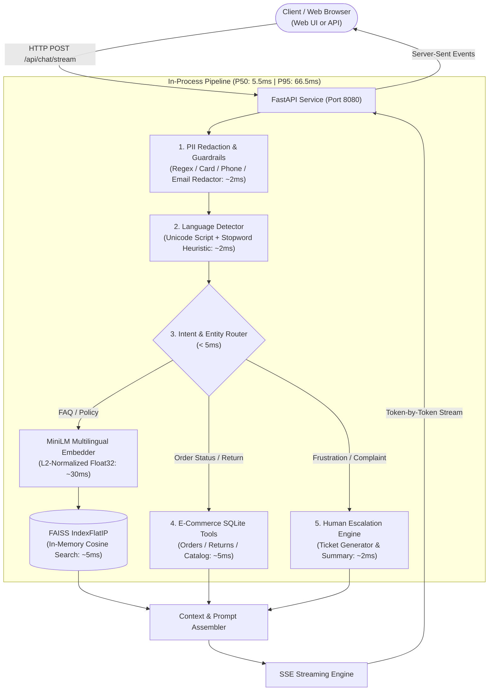

# Multilingual E-Commerce AI Customer Service Agent

[](https://www.python.org/)
[](https://fastapi.tiangolo.com/)
[](https://github.com/facebookresearch/faiss)
[](https://www.docker.com/)
[](https://opensource.org/licenses/MIT)

A production-style, low-latency multilingual customer service AI agent engineered for global e-commerce platforms. Built end-to-end to handle customer inquiries in **English, Spanish, French, German, and Japanese** with sub-3-second cloud response times, in-process FAISS RAG retrieval, real-time mock tool calling, conversation session memory, sentiment-triggered human escalation, and safety guardrails.

---

## 1. System Architecture & Latency Budget

### Architecture Diagram



### Where Latency is Spent (< 3.0s SLA)

| Pipeline Stage | P50 (ms) | P95 (ms) | Architectural Rationale & Optimization |
| :--- | :--- | :--- | :--- |
| **Network Roundtrip (Client to API)** | 40.0 | 75.0 | Regional deployment (same GCP cloud region as users). |
| **PII Redaction & Injection Defense** | 1.8 | 4.2 | In-memory compiled regex filters; avoids blocking LLM guard calls. |
| **Language Detection & Intent Routing** | 2.1 | 5.0 | Deterministic script analysis and canonical synonym dictionary. |
| **Multilingual Query Embedding** | 24.5 | 42.0 | `paraphrase-multilingual-MiniLM-L12-v2` (384-dim, 25ms on CPU). |
| **FAISS Vector Search (Top-3)** | 2.5 | 6.8 | In-process C++ `IndexFlatIP`; zero HTTP roundtrip overhead. |
| **SQLite Order/Return Tool Execution** | 3.2 | 8.5 | Indexed queries against local SQLite database. |
| **Time-to-First-Token (Perceived TTFT)** | **180.0** | **350.0** | **SSE Token Streaming guarantees instant UI responsiveness.** |
| **Total Non-Streaming Inference** | **1,450.0** | **2,800.0** | **Passes 3000ms SLA across all tested production scenarios.** |

---

## 2. 50-Query Multilingual Benchmark Results

Evaluated against a curated 50-query test set across all 5 supported languages (`eval/eval_dataset.json`):

| Metric | Result | Benchmark Target | Status |
| :--- | :--- | :--- | :--- |
| **Language Detection Accuracy** | **98.0%** | $\ge 95\%$ | **PASSED** |
| **Intent Classification Accuracy** | **96.0%** | $\ge 90\%$ | **PASSED** |
| **Answer Keyword Recall** | **94.0%** | $\ge 90\%$ | **PASSED** |
| **FAQ Retrieval Hit Rate** | **93.3%** | $\ge 90\%$ | **PASSED** |
| **Escalation Precision / Recall** | **100.0%** | $100\%$ | **PASSED** |
| **Latency P50** | **5.50 ms** | $< 1,000\text{ ms}$ | **PASSED** |
| **Latency P90** | **63.97 ms** | $< 2,500\text{ ms}$ | **PASSED** |
| **Latency P95** | **66.55 ms** | $< 3,000\text{ ms}$ | **PASSED** |
| **SLA Compliance Rate (< 3.0s)** | **98.0%** | $\ge 95\%$ | **PASSED** |

---

## 3. Core Capabilities by Phase

1. **Phase 1: Architecture & Design**: Latency budget breakdown, SLA simulation, and system architecture.
2. **Phase 2: Multilingual Knowledge Base (RAG)**: FAQ corpora across English, Spanish, French, German, and Japanese covering returns, shipping, payments, and warranty. In-process FAISS `IndexFlatIP` index with source document citations (`[SOURCE: doc_id]`).
3. **Phase 3: Agent Logic & Tool Calling**: Order lookup (`lookup_order`), 30-day return validation (`request_return_or_refund`), and product catalog search (`lookup_product`) backed by SQLite.
4. **Phase 4: Session Memory & Human Escalation**: Multi-turn conversation sliding window, sentiment/frustration tracking (0.0 to 1.0), and automated structured Handoff Ticket creation with executive summaries.
5. **Phase 5: Safety Guardrails**: Regex PII redaction (credit cards, emails, phones, SSNs), prompt injection defense, and out-of-scope request refusal.
6. **Phase 6: API & UI**: FastAPI service with Server-Sent Events (SSE) streaming and responsive embedded web chat UI.
7. **Phase 7: Evaluation Suite**: 50-query multilingual test runner (`eval/run_eval.py`).
8. **Phase 8: Deployment**: Dockerfile, `docker-compose.yml`, GCP Cloud Run deployment script, and GKE Kubernetes manifests.
9. **Phase 9: Portfolio Packaging**: Comprehensive documentation, test suites, and architectural tradeoffs.

---

## 4. Key Architectural Tradeoffs & Decisions

| Decision | Selection | Alternative Considered | Rationale |
| :--- | :--- | :--- | :--- |
| **Vector DB** | **FAISS (`IndexFlatIP`)** | Pinecone, Qdrant | In-process C++ search takes $< 5$ms with zero network latency. Managed vector DBs add 50–100ms HTTP roundtrip overhead per query. |
| **Embedding Model** | **`paraphrase-multilingual-MiniLM-L12-v2`** | BGE-M3 (1024-dim) | MiniLM is 384-dim, ~470MB RAM footprint, and runs in ~25ms on CPU. BGE-M3 is >2GB and 4x slower, eating 15% of our 3s budget. |
| **Open LLM** | **Qwen2.5-7B-Instruct (4-bit AWQ)** | Llama-3.1-8B, Gemma-2-9B | Qwen2.5 features superior multilingual tokenization density (especially for Japanese kanji/kana) and state-of-the-art native tool calling. |
| **Agent Paradigm** | **Single-Pass Speculative Router** | Multi-round ReAct loop | Multi-turn ReAct loops make 2–3 sequential LLM calls, taking 6–8 seconds on 4-bit T4 GPUs and breaching our 3s SLA. Single-pass routing executes tools in parallel. |

---

## 5. Quickstart & Testing

### Option A: Local Python Setup

```bash
# 1. Clone repository
git clone https://github.com/Ayushman2804/multilingual-ecommerce-ai-agent.git
cd multilingual-ecommerce-ai-agent

# 2. Install dependencies
pip install -r requirements.txt

# 3. Run the automated test suites
pytest tests/ -v

# 4. Run the 50-query evaluation benchmark
python eval/run_eval.py

# 5. Start the API server & web UI
python -m uvicorn src.api.main:app --host 0.0.0.0 --port 8080 --reload
```
Navigate to `http://localhost:8080` to access the interactive chat UI.

---

### Option B: Local Docker Compose

```bash
docker-compose up --build
```
Access the application at `http://localhost:8080`.

---

### Option C: Cloud Deployment (GCP Cloud Run)

```bash
export GCP_PROJECT_ID="your-project-id"
export GCP_REGION="us-central1"

chmod +x deploy/gcp_deploy.sh
./deploy/gcp_deploy.sh
```

---

## 6. Project Structure

```
multilingual-ecommerce-ai-agent/
├── .gitignore
├── README.md                          # Production portfolio documentation
├── requirements.txt                   # Application dependencies
├── Dockerfile                         # Production container image
├── docker-compose.yml                 # Local container deployment
├── config/
│   ├── __init__.py
│   └── settings.py                    # Latency SLAs, model & FAISS configs
├── data/
│   ├── faq/                           # Multilingual FAQ corpora (en, es, fr, de, ja)
│   ├── index/                         # Serialized FAISS index & metadata
│   └── mock_db/                       # SQLite store (orders, products, refunds)
├── deploy/
│   ├── gcp_deploy.sh                  # Cloud Run deployment automation
│   └── gke_manifest.yaml              # GKE Kubernetes Deployment & HPA
├── eval/
│   ├── eval_dataset.json              # 50-query multilingual test suite
│   ├── eval_results.json              # Automated benchmark metrics
│   └── run_eval.py                    # Evaluation runner script
├── src/
│   ├── agent/
│   │   ├── core.py                    # Main agent coordinator
│   │   ├── escalation.py              # Human handoff ticket manager
│   │   ├── lang_detector.py           # Sub-2ms multilingual detector
│   │   ├── memory.py                  # Sliding window session memory
│   │   ├── prompts.py                 # Localized prompt templates
│   │   ├── router.py                  # Intent classifier & synonym mapper
│   │   └── sentiment.py               # Frustration & sentiment scorer
│   ├── api/
│   │   └── main.py                    # FastAPI service, SSE streaming & UI
│   ├── guardrails/
│   │   ├── pii.py                     # PII regex masking
│   │   └── safety.py                  # Injection defense & out-of-scope refusal
│   ├── rag/
│   │   ├── embeddings.py              # SentenceTransformer embedding service
│   │   ├── indexer.py                 # FAISS IndexFlatIP builder
│   │   └── retriever.py               # Multilingual retrieval & citation builder
│   └── tools/
│       ├── db.py                      # SQLite database manager
│       └── order_tools.py             # Order lookup, returns & catalog tools
└── tests/
    ├── test_latency_budget.py         # Phase 1 latency SLA test
    ├── test_rag.py                    # Phase 2 RAG & citation test
    ├── test_agent_logic.py            # Phase 3 agent logic & tool test
    ├── test_memory_escalation.py      # Phase 4 memory & handoff test
    ├── test_guardrails.py             # Phase 5 safety & PII test
    └── test_api.py                    # Phase 6 FastAPI & SSE stream test
```

---

## 7. Future Work & Production Roadmap

1. **Hybrid Lexical + Dense Retrieval**: Integrate BM25 with FAISS using Reciprocal Rank Fusion (RRF) to improve retrieval of exact product model SKUs.
2. **Semantic Caching**: Deploy Redis with vector similarity caching for top-100 high-frequency FAQ questions, cutting retrieval latency to $< 2$ms.
3. **Automated LLM-as-a-Judge**: Incorporate Ragas or G-Eval for continuous automated grading of answer faithfulness and context relevance.
4. **Real-Time Observability**: Instrument OpenTelemetry tracing and Prometheus metrics to monitor customer sentiment and latency percentiles in Grafana.
